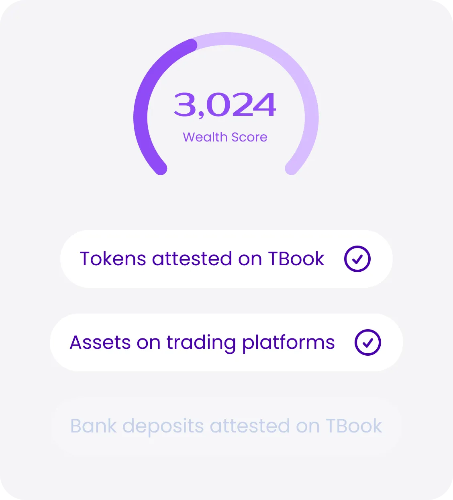
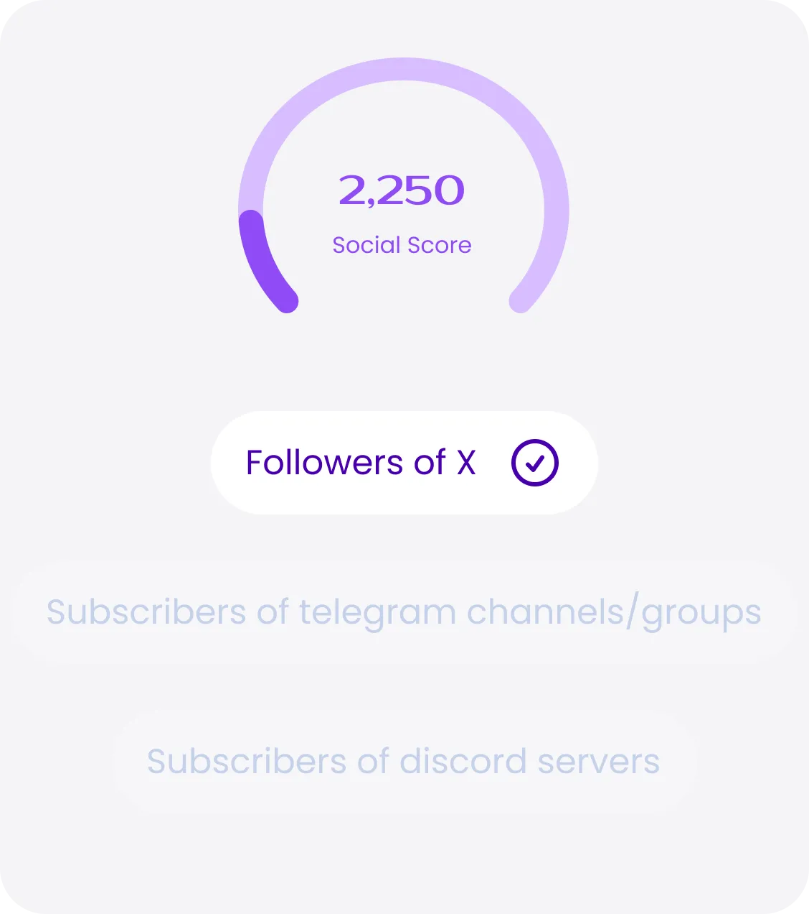
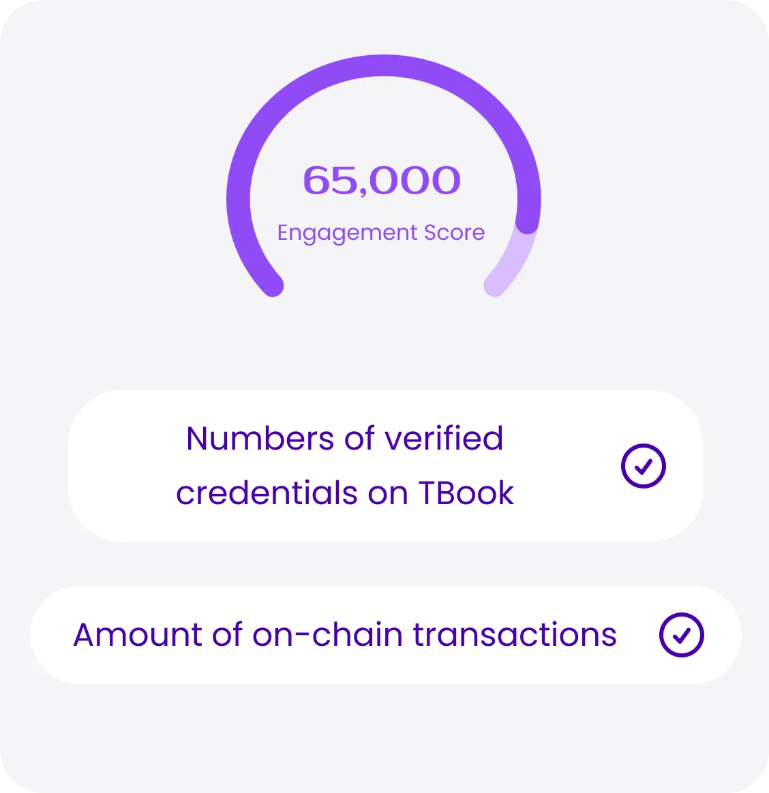

# WISE Score for Community Value Assessment

## What is the WISE Score?

With tailored metrics for each dimension, WISE Score offers users a comprehensive view of their impact in both on-chain and off-chain activities within the Web3 ecosystem. Beyond mere transactional data, it delves into the breadth and depth of user engagement, loyalty, and unique identity roles, shaping a holistic understanding of their incentive footprint.

In the product Incentive Passport from TBook, every user can generate their own unique WISE Score.

## WISE Indicator System

When evaluating a user’s contribution within the Web3 ecosystem, it’s crucial to consider various factors regarding user interaction with the protocol and project campaigns. Metrics such as the frequency, depth, and scope of user engagement play a significant role. Additionally, factors like user identity should not be overlooked.

Early adopters who have been integral to the project’s growth demonstrate a high level of loyalty, which further enhances their significance. In light of these considerations, the WISE Score has been designed to encompass four key dimensions: Wealth, Identity, Social, and Engagement (W.I.S.E.).

### 1. Wealth (W)

<figure><figcaption></figcaption></figure>

We aggregate a user’s attested wealth in the previous week and denote this wealth in the unit of **USD**. These wealth include:

Crypto coins and tokens, that users have attested on TBook
Total assets on trading platforms, attested by users on TBook
Bank deposits, attested by users on TBook

### 2. Identity (I)

<figure><figcaption></figcaption></figure>

The identity dimension takes into account a user's verified credentials, such as KYC, social media profiles, and other forms of identity verification. A higher identity score indicates a more trustworthy and authentic user.

### 3. Social (S)

<figure><figcaption></figcaption></figure>

The social dimension measures a user's connections and interactions within the TBook community. This includes factors such as the number of followers, the quality of interactions, and the user's overall social influence.

### 4. Engagement (E)

<figure><figcaption></figcaption></figure>

The engagement dimension assesses a user's level of activity and contribution to the TBook community. This includes actions such as posting content, participating in discussions, and engaging with other users' content.

## Calculating the WISE Score

The WISE Score is calculated using a proprietary algorithm that assigns weights to each dimension based on their relative importance. The exact formula is not disclosed to prevent gaming of the system.

## Accessing Your WISE Score

Users can view their WISE Score on their TBook profile page. The score is updated in real-time based on the user's activity and interactions within the community.

## Future Developments

The TBook team is continuously working on refining and expanding the WISE Score system. Future updates may include additional dimensions, more granular scoring, and integration with other TBook features.

Stay tuned for more updates on the WISE Score and other exciting developments in the TBook community!
