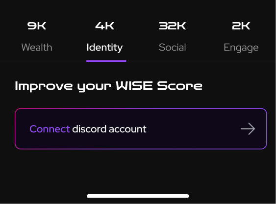
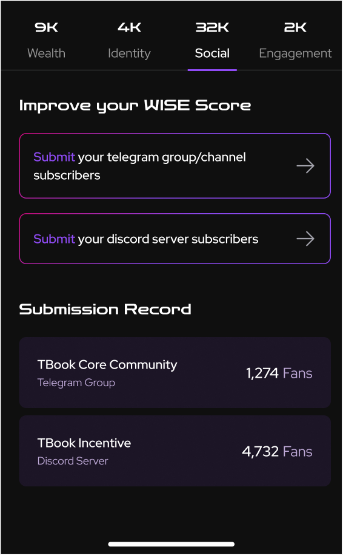

# WISE Score for Community Value Assessment

## What is the WISE Score?

With tailored metrics for each dimension, WISE Score offers users a comprehensive view of their impact in both on-chain and off-chain activities within the Web3 ecosystem. Beyond mere transactional data, it delves into the breadth and depth of user engagement, loyalty, and unique identity roles, shaping a holistic understanding of their incentive footprint.

In the product Incentive Passport from TBook, every user can generate their own unique WISE Score.

## WISE Indicator System
When evaluating a user’s contribution within the Web3 ecosystem, it’s crucial to consider various factors regarding user interaction with the protocol and project campaigns. Metrics such as the frequency, depth, and scope of user engagement play a significant role. Additionally, factors like user identity should not be overlooked.

Early adopters who have been integral to the project’s growth demonstrate a high level of loyalty, which further enhances their significance. In light of these considerations, the WISE Score has been designed to encompass four key dimensions: Wealth, Identity, Social, and Engagement (W.I.S.E.).

## When WISE Score and WISE Score Leaderboard update?

1. Everytime you open the WISE Score page or reload the page, TBook will recalculate your WISE Score.
Once you improve your Identity Score or Social Score, TBook will add the Score after seconds.
2. WISE Score Leaderboard updates every 10 minutes.
Once users generating their WISE Score, they will view their ranking in the next leaderboard update.

### Wealth

<figure><figcaption></figcaption></figure>

We aggregate a user’s attested wealth in the previous week and denote this wealth in the unit of USD. These wealth include:

Crypto coins and tokens, that users have attested on TBook
Total assets on trading platforms, attested by users on TBook
Bank deposits, attested by users on TBook

<figure><figcaption></figcaption></figure>

<figure><figcaption></figcaption></figure>

<figure><figcaption></figcaption></figure>

<figure><figcaption></figcaption></figure>

## The Metrics we supported until now

###

1. We calculate a user’s  

## Summary

The WISE Score serves as an impartial and measurable benchmark for assessing the holistic contribution and value of accounts, both within the Web3 ecosystem and beyond. Through meticulous examination of user behaviors, the WISE Score assigns a numerical rating to each holder of a TBook incentive passport.

Unlike simplistic metrics that merely tally interaction volumes and values with smart contracts, protocols, and dApps, the WISE Score’s evaluation framework is more nuanced. It scrutinizes the extent and depth of a user’s involvement in Web3 incentive campaigns, their steadfast loyalty, as well as any unique identity roles and credentials they possess.
