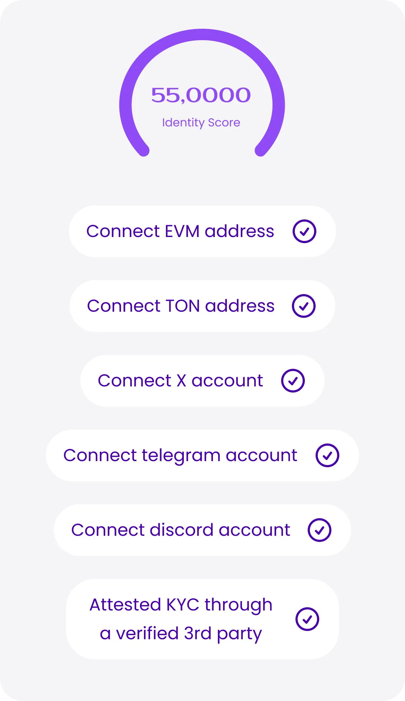
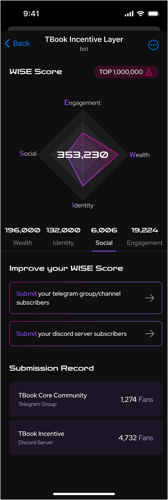

# WISE Score for Community Value Assessment

## What is the WISE Score?

With tailored metrics for each dimension, WISE Score offers users a comprehensive view of their impact in both on-chain and off-chain activities within the Web3 ecosystem. Beyond mere transactional data, it delves into the breadth and depth of user engagement, loyalty, and unique identity roles, shaping a holistic understanding of their incentive footprint.

In the product Incentive Passport from TBook, every user can generate their own unique WISE Score.

## WISE Indicator System

When evaluating a user’s contribution within the Web3 ecosystem, it’s crucial to consider various factors regarding user interaction with the protocol and project campaigns. Metrics such as the frequency, depth, and scope of user engagement play a significant role. Additionally, factors like user identity should not be overlooked.

Early adopters who have been integral to the project’s growth demonstrate a high level of loyalty, which further enhances their significance. In light of these considerations, the WISE Score has been designed to encompass four key dimensions: Wealth, Identity, Social, and Engagement (W.I.S.E.).

### 1. Wealth (W)

<figure><figcaption></figcaption></figure>

We aggregate a user’s attested wealth in the previous week and denote this wealth in the unit of **USD**. These wealth include:

1. Crypto coins and tokens, that users have attested on TBook
2. Total assets on trading platforms, attested by users on TBook
3. Bank deposits, attested by users on TBook

### 2. Identity (I)

<figure><figcaption></figcaption></figure>

Identity score is a metrics that are based on the following:

1. User has linked TBook passport to crypto address
2. Users has linked TBook passport to social apps
3. User has attested their KYC through a verified third party(like Binance)

### 3. Social (S)

<figure><figcaption></figcaption></figure>

Social impact is measured daily, based on the following:

1. Total followers of a user from these social networks: Twitter.
2. Total number of subscribers of Telegram groups and channels that a user is an administrator in.
3. Total amount of subscribers of discord servers that a user is an administrator in.

### 4. Engagement (E)

<figure><figcaption></figcaption></figure>

We measure users’ engagement based on the following metrics:

1. Total number of verified credentials on TBook.
2. Total amount of on-chain transactions.

### An Example of WISE Score

Shown in the Figure is our WISE Score snapshot in TBook. The queried address had a WISE Score of 353,230, ranking in the top 30% among all TBook WISE Score holders.

<figure><figcaption></figcaption></figure>

This address scored 196,000 for Wealth, interacting with a relatively high variety of contracts and protocols. However, this address lags on social, currently scoring only 6,000. To effectively improve the WISE score, this user could focus on increasing the contribution in incentive campaigns. The 132,000 points this address obtained in the Identity dimension mainly come from proof of holding Ethereum Address and Twitter Profiles. Although this address did not receive previous airdrops from TON, it could improve its Engagement dimension score by verifying credentials in TBook incentive campaigns.

## Summary

The WISE Score serves as an impartial and measurable benchmark for assessing the holistic contribution and value of accounts, both within the Web3 ecosystem and beyond. Through meticulous examination of user behaviors, the WISE Score assigns a numerical rating to each holder of a TBook incentive passport.

Unlike simplistic metrics that merely tally interaction volumes and values with smart contracts, protocols, and dApps, the WISE Score’s evaluation framework is more nuanced. It scrutinizes the extent and depth of a user’s involvement in Web3 incentive campaigns, their steadfast loyalty, as well as any unique identity roles and credentials they possess.
